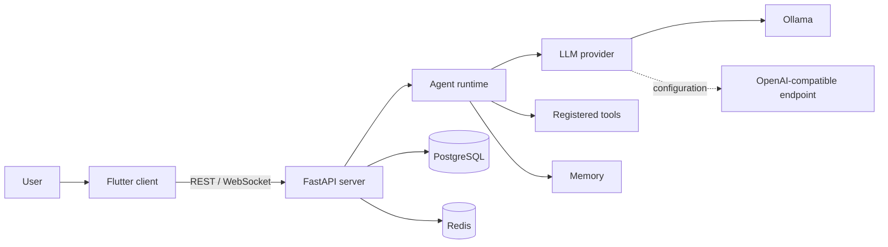

# NEXUS

> Agentic AI Operating System

NEXUS is a provider-agnostic agentic AI operating system built with Flutter and
a custom Python runtime. It is designed to turn natural-language goals into
observable, tool-using, memory-aware workflows with human approval at sensitive
boundaries.

The mission system now keeps history, tasks, and generated artifacts across
server restarts. Flutter shows live execution, lets you reopen a mission, and
provides task completion controls and an artifact reader.

## Why we did not build a chatbot

A chatbot waits for the next message. NEXUS is designed around durable goals
and explicit execution. The completed runtime will be:

- goal-oriented and plan-driven;
- able to use only registered, schema-validated tools;
- stateful and memory-aware;
- observable through a replayable event stream;
- interruptible, cancellable, and approval-gated;
- independent of any single model provider.

No provider secret is stored in the Flutter application. The client talks only
to the NEXUS backend.

## Current interface

Home accepts a goal and displays its latest state. Missions lists historical
and active runs with progress and opens a saved timeline at `/missions/:id`.
Tasks and artifacts are accessible from the dashboard or filtered to one run.
Knowledge and Memory contain the document and memory interfaces. Home also has
opt-in voice input: Speak, finish recording, review/edit the transcript, then
start a mission. Completed replies offer manually triggered device read-aloud
on Android/web, with Stop controls. See [voice setup](docs/voice.md) and
[speech-output privacy and platform limits](docs/speech-output.md).

## Architecture



The provider and agent boundaries are implemented without an agent framework.
See [the architecture document](docs/architecture.md),
[agent runtime](docs/agent-runtime.md), and [tool system](docs/tool-system.md).

## Repository layout

```text
apps/nexus_flutter/       Flutter client (Android, Windows, Web)
services/nexus_server/    FastAPI backend
packages/                 Shared protocol/schema boundaries
infra/                    Compose services
docs/                     Engineering documentation
scripts/                  Local verification helpers
```

## Prerequisites

- Flutter 3.44.7
- Python 3.12 or newer
- Docker Desktop or Docker Engine with Compose
- An Ollama-compatible local setup when model-backed phases are enabled

## Start with Docker

Copy the example environment file if you want to override defaults:

```bash
cp .env.example .env
docker compose up --build
```

The stack exposes:

| Service | Address | Purpose |
| --- | --- | --- |
| NEXUS API | `http://localhost:8000` | REST service and API docs |
| PostgreSQL | `postgres:5432` (internal) | durable application state |
| Redis | `redis:6379` (internal) | transient coordination |
| Ollama (optional profile) | `http://localhost:11434` | local model endpoint |

The core command does not pull the large Ollama image. Start the local-model
profile when required, choose a model explicitly, pull it yourself, and set
`NEXUS_OLLAMA_MODEL`:

```bash
docker compose --profile local-model up --build
```

For a deterministic demo without a model download, select the mock provider
before starting the stack:

```powershell
$env:NEXUS_LLM_PROVIDER="mock"
docker compose up --build
```

Verify liveness and readiness:

```bash
curl http://localhost:8000/health
curl http://localhost:8000/ready
```

`/health` proves the API process is alive. `/ready` returns HTTP 503 until both
PostgreSQL and Redis are reachable.

Create and inspect a run through the REST API:

```bash
curl -X POST http://localhost:8000/api/v1/runs \
  -H "Content-Type: application/json" \
  -d '{"goal":"Create a task to learn Flutter","user_id":"local"}'
curl http://localhost:8000/api/v1/runs?user_id=local
curl http://localhost:8000/api/v1/tasks?user_id=local
```

For the multi-step demo, enter **Create a Flutter architecture study guide**
in Home with the mock provider enabled. It schedules a study task and saves a
clearly labeled demo study guide. Open Missions to inspect both steps, then
open Tasks to mark the task complete or Artifacts to read the guide. Restarting
the API preserves these records. Mock output is deterministic; real model
quality requires a configured inference provider.

## Run the backend locally

```powershell
python -m venv .venv
.\.venv\Scripts\python -m pip install -e ".\services\nexus_server[dev]"
cd services\nexus_server
..\..\.venv\Scripts\python -m uvicorn app.main:app --reload
```

Open `http://localhost:8000/docs` for the generated OpenAPI UI.

## Run Flutter

```bash
cd apps/nexus_flutter
flutter pub get
flutter run
```

Defaults are platform-aware: Android emulators connect to `10.0.2.2:8000`,
while Windows and Web connect to `localhost:8000`. Override the address for a
physical device or remote backend:

```bash
flutter run --dart-define=NEXUS_API_BASE_URL=http://192.168.1.10:8000
```

Exercise the same typed Dio adapter without launching a UI:

```bash
dart run tool/backend_smoke.dart http://localhost:8000
```

## Configuration

All supported development variables are documented in `.env.example`.
Important values include:

- `DATABASE_URL` and `REDIS_URL` for infrastructure;
- `NEXUS_LLM_PROVIDER` for provider selection;
- `NEXUS_OLLAMA_BASE_URL` and `NEXUS_OLLAMA_MODEL` for local inference;
- `NEXUS_LLM_BASE_URL`, `NEXUS_LLM_MODEL`, and `NEXUS_LLM_API_KEY` for an
  OpenAI-compatible endpoint;
- `NEXUS_MAX_AGENT_ITERATIONS` for the bounded loop;
- disabled-by-default feature gates for web search, voice, and code execution.

Do not commit `.env`. It is ignored intentionally.

## Testing

Backend:

```bash
cd services/nexus_server
python -m ruff format --check --no-cache .
python -m ruff check --no-cache .
python -m mypy app
python -m pytest
```

Flutter:

```bash
cd apps/nexus_flutter
dart format --output=none --set-exit-if-changed lib test
flutter analyze
flutter test
flutter build web
```

On Windows, `scripts/check.ps1` runs the complete local check set after the
Python virtual environment has been installed.

## Security model

- Model credentials live only on the backend.
- No provider key is bundled into Flutter.
- Dangerous capabilities are disabled by default.
- Liveness does not expose dependency exception messages.
- Readiness reports only sanitized exception types.
- Model plans and actions are schema-validated before they can select tools.
- Arbitrary shell, Python, SQL, deletion, and network execution are out of scope
  for the MVP.

See [security architecture](docs/architecture.md#security-boundaries).

## Engineering decisions

Saved memories can be corrected from the Memory screen. See
[memory controls](docs/memory-controls.md) for workspace compatibility, editing
semantics, and remaining memory integration work.
The agent can also [search saved memories](docs/memory-retrieval.md) through a
bounded, read-only tool with workspace scoping and provenance.

- The core loop is implemented directly rather than hidden in an agent
  framework.
- REST handles commands and snapshots; WebSockets carry ordered events.
- FastAPI dependencies keep infrastructure replaceable in tests.
- Riverpod owns async state; widgets do not call Dio directly.
- Liveness and readiness are separate so partial outages remain diagnosable.
- Ollama is present but no model is silently downloaded.

## Roadmap

- **Phase 0 — Foundation:** Flutter, FastAPI, Compose, health, CI
- **Phase 1 — Agent engine:** providers, planner, state machine, safe tools
- **Phase 2 — Streaming UI:** events, WebSocket recovery, approval cards
- **Phase 3 — Documents/RAG:** ingestion, retrieval, citations
- **Phase 4 — Memory:** policy, retrieval, user controls
- **Phase 5 — Missions:** history, progress, persistent tasks and artifacts
- **Phase 6 — Voice:** speech input, device read-aloud, and explicit follow-up context (in progress)
- **Phase 7 — Code intelligence:** backend ZIP import/index/search started; graphs and UI pending
- **Phase 8 — Autonomous missions:** scheduling, retries, notifications

Computer control, browser automation, and code execution remain out of scope.
See [code intelligence](docs/code-intelligence.md) for repository upload APIs,
source-index limits, and the remaining Phase 7 work.
Backend voice input is disabled by default; speech models are configured
explicitly and never downloaded automatically. Device read-aloud is opt-in per
reply and may use the system speech engine's network services.

Completed missions can seed a new typed or spoken goal through **Follow up**.
See [conversational context](docs/conversations.md) for the bounded history
contract, mock demo, and remaining voice verification work.

See [mission behavior and verification](docs/missions.md) for the API contract,
tested scenarios, changed files, and remaining limitations. This is a local
development application: user IDs are workspace labels, not authentication.

## License

[MIT](LICENSE) © 2026 Mayank Gupta
