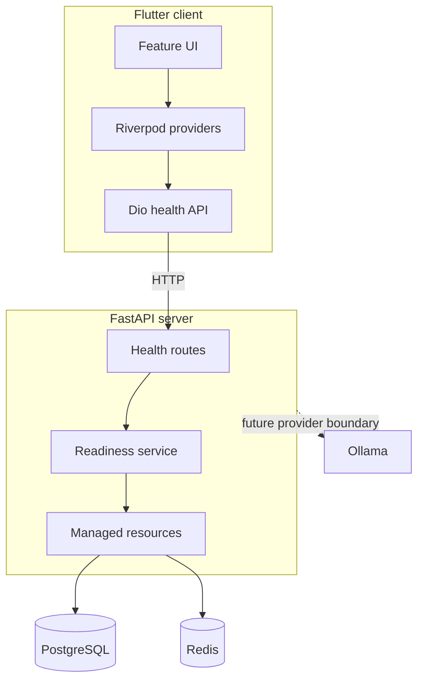
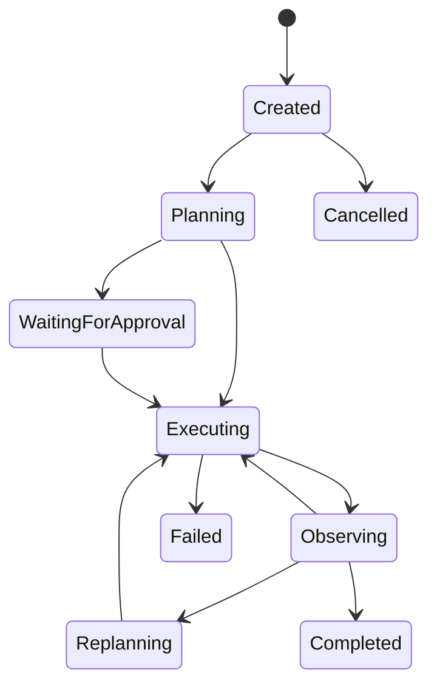

# NEXUS Architecture

## Purpose

NEXUS separates a cross-platform control surface from a trusted agent runtime.
This keeps model credentials and tool permissions off end-user devices while
allowing the inference provider to change through configuration.

## Foundation topology



The API owns the SQLAlchemy engine and Redis client for its lifetime. Resource
construction is explicit, and shutdown disposes both clients. Tests replace the
readiness dependency without opening external connections.

## Client boundaries

The Flutter code is feature-first:

```text
core/config       compile-time and platform-aware settings
core/networking   shared transport construction
features/*/data   backend adapters
features/*/domain immutable typed values
features/*/application Riverpod state
features/*/presentation widgets
routing            navigation shell
theme              visual tokens
```

Widgets consume provider state and do not issue network requests. The backend
base URL can be supplied with `NEXUS_API_BASE_URL`; no secret configuration is
supported in the client.

## Health semantics

`GET /health` is a liveness probe. It has no external I/O and remains available
during database or cache outages.

`GET /ready` concurrently checks PostgreSQL and Redis. It returns a typed
component map and HTTP 503 when any required dependency is down. Concurrent
checks prevent one dependency timeout from needlessly delaying the other.

## Agent boundary

The runtime uses an explicit state machine behind the API:



Planner and executor outputs are Pydantic-validated. The runtime enforces
iteration limits, permissions, timeouts, persistence, and terminal transitions.

## Data ownership

PostgreSQL stores run snapshots (including plans and observations), ordered
events, documents/chunks, memories, tasks, and artifacts. The task and artifact
tables index `(user_id, run_id)` so outputs can be retrieved per workspace and
mission. Redis is reserved for coordination; durable history lives in SQL.

Ordered run events are persisted before publication. WebSocket clients
reconnect with a last-seen sequence and replay missed database events.

## Provider isolation

Flutter never talks to Ollama or a paid endpoint. The server exposes an
`LLMProvider` protocol with Ollama, OpenAI-compatible, and deterministic mock
implementations. Provider-specific payloads stop at their adapters.

## Mission control surface

The Missions tab queries saved runs and refreshes their status. Selecting a run
loads `/missions/:id`, restores its snapshot and trace, and subscribes to new
events only while the run is active. Tasks and artifacts have separate screens
with optional run filters. Task status changes are persisted through PATCH;
artifacts are created by a registered local-write tool.

Schema initialization currently creates missing tables on startup. Versioned
schema migrations and distributed execution leases remain future work. Use a
single API worker for this release.

## Speech input boundary

Flutter captures mono PCM16 through an injectable audio manager and streams one
bounded utterance to `/ws/voice`. The backend owns the `VoiceProvider` adapter
(self-hosted whisper.cpp or a labeled deterministic mock). Session admission,
audio limits, deadlines, and cancellation are enforced before returning a final
transcript. Browser origins are checked separately from HTTP CORS.

Audio is not persisted by NEXUS. The user reviews text before the normal mission
API receives a goal; voice cannot bypass tool permissions. Completed replies can
be read by an injectable device speech-output adapter on Android/web. A shared
controller arbitrates playback against microphone capture and invalidates stale
results on interruption. Read-aloud requires an explicit button press; system
voices may process text online. Native Windows output is gated pending safe
cancellation support. Multi-turn context and server-side synthesis remain future
work. See [voice](voice.md) and [spoken replies](speech-output.md).

## Security boundaries

1. Secrets exist only in backend process configuration.
2. Model output is untrusted structured input.
3. Tools must be registered and schema-validated.
4. External and dangerous actions require policy approval or remain disabled.
5. Logs and readiness payloads must not contain credentials or raw connection
   details.
6. Agent loops are bounded and cancellable.

## Deployment shape

The development Compose project includes the API, PostgreSQL, Redis, and an
optional Ollama profile. Named volumes preserve local data. Ollama starts empty;
model selection and download remain explicit operator actions.

Production deployments should replace the development credentials, pin images
to reviewed digests, terminate TLS at an ingress, restrict exposed database
ports, and use managed secrets.

The development stack also keeps PostgreSQL and Redis on the private Compose
network; only the API and optional Ollama endpoint publish host ports.
