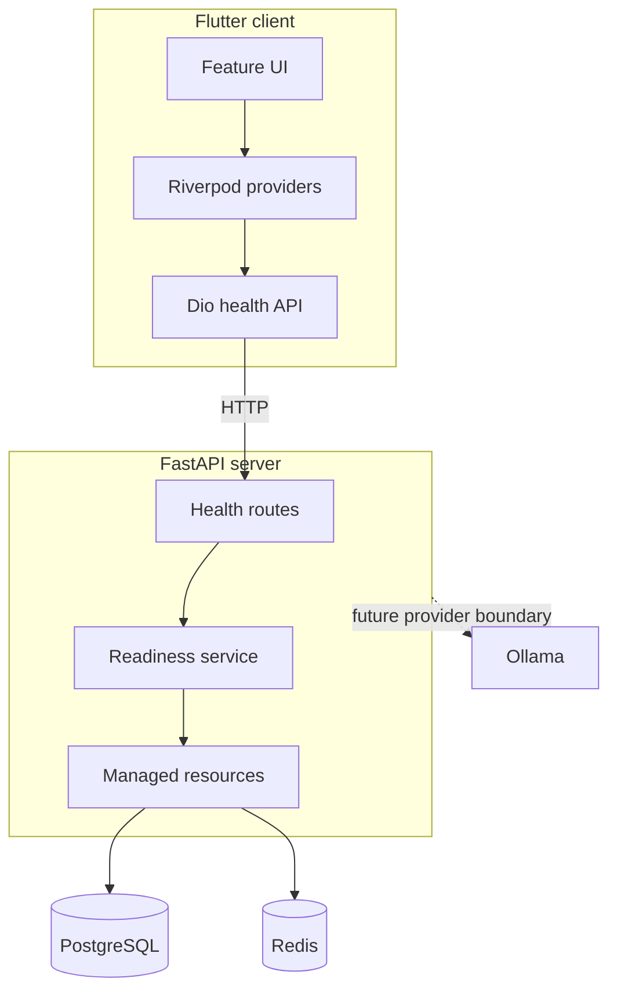
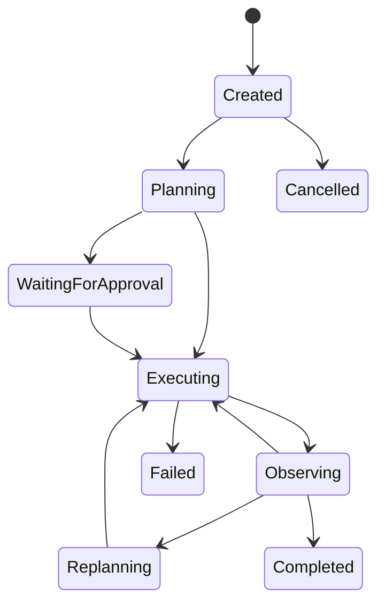

# NEXUS Architecture

## Purpose

NEXUS separates a cross-platform control surface from a trusted agent runtime.
This keeps model credentials and tool permissions off end-user devices while
allowing the inference provider to change through configuration.

## Phase 0 topology



The API owns the SQLAlchemy engine and Redis client for its lifetime. Resource
construction is explicit, and shutdown disposes both clients. Tests replace the
readiness dependency without opening external connections.

## Client boundaries

The Flutter code is feature-first:

```text
core/config       compile-time and platform-aware settings
core/networking   shared transport construction
features/*/data   backend adapters
features/*/domain immutable typed values
features/*/application Riverpod state
features/*/presentation widgets
routing            navigation shell
theme              visual tokens
```

Widgets consume provider state and do not issue network requests. The backend
base URL can be supplied with `NEXUS_API_BASE_URL`; no secret configuration is
supported in the client.

## Health semantics

`GET /health` is a liveness probe. It has no external I/O and remains available
during database or cache outages.

`GET /ready` concurrently checks PostgreSQL and Redis. It returns a typed
component map and HTTP 503 when any required dependency is down. Concurrent
checks prevent one dependency timeout from needlessly delaying the other.

## Target agent boundary

Phase 1 adds an explicit state machine behind the API:



Planner and executor outputs will be Pydantic-validated. The runtime—not the
model—will enforce iteration limits, permissions, timeouts, persistence, and
terminal transitions.

## Data ownership

PostgreSQL is the future source of truth for runs, steps, events, tool calls,
documents, memories, tasks, and notes. Redis is reserved for transient
coordination and fan-out; correctness cannot depend on Redis retaining durable
history.

Ordered run events will be persisted before publication. WebSocket clients will
reconnect with a last-seen sequence and replay missed database events.

## Provider isolation

Flutter never talks to Ollama or a paid endpoint. The server will expose an
`LLMProvider` protocol with Ollama, OpenAI-compatible, and deterministic mock
implementations. Provider-specific payloads will stop at their adapters.

## Security boundaries

1. Secrets exist only in backend process configuration.
2. Model output is untrusted structured input.
3. Tools must be registered and schema-validated.
4. External and dangerous actions require policy approval or remain disabled.
5. Logs and readiness payloads must not contain credentials or raw connection
   details.
6. Agent loops are bounded and cancellable.

## Deployment shape

The development Compose project includes the API, PostgreSQL, Redis, and an
optional Ollama profile. Named volumes preserve local data. Ollama starts empty;
model selection and download remain explicit operator actions.

Production deployments should replace the development credentials, pin images
to reviewed digests, terminate TLS at an ingress, restrict exposed database
ports, and use managed secrets.

The development stack also keeps PostgreSQL and Redis on the private Compose
network; only the API and optional Ollama endpoint publish host ports.
